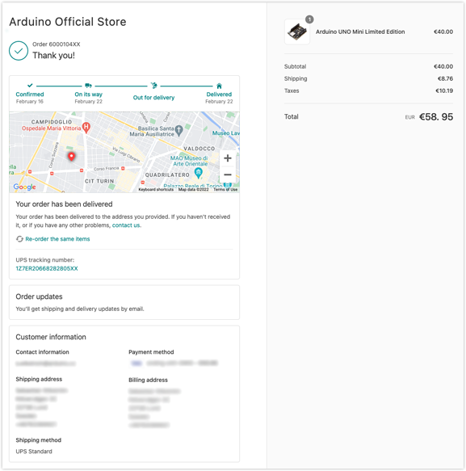

Learn how to track orders made from the Arduino Store.

> [!TIP]
> If you made your order through Amazon, check [Amazon Customer Service](https://www.amazon.com/gp/help/customer/display.html?nodeId=GENAFPTNLHV7ZACW){.link-external}.

---

## Open the order status page

You can open the status page for your order in two ways:

**Using a confirmation email:**

1. Open the [Shopify orders page](https://shopify.com/43847352471/account/orders).

2. Sign in with the email you use for your Arduino account.

3. Select the order you want to view.

**Using a confirmation email:**

1. Open the inbox of the email you used for your order.
1. Look for an email with the subject "Order XXXXXX confirmed" or "A shipment from order XXXXXX is on the way", with the sender **Arduino Official Store** (support@arduino<!-- no email-->.cc).
2. Open the email and click **View your order**.

---

## Using the order status page

On the order status page, you can:

* Review order details.
* Check the status of your shipment
* If your order is shipping with a supported carrier, you can view real-time updates on the location of the shipment.
* For supported carriers, the carrier tracking number will be linked to the carrier's tracking page, which may contain additional details.

