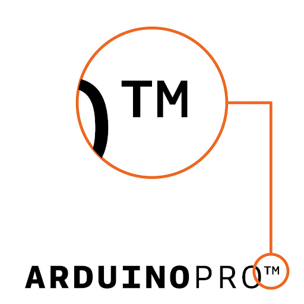
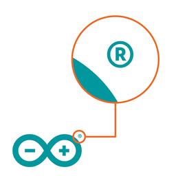

A trademark is a word or symbol representing a company or product. It is used to identify a specific source of goods or services, protecting that source from confusion in the minds of consumers with other sources. Trademarks are recognizable because they are followed by the symbols ™ or ®.

> 

Most hardware designs of Arduino are open-source, but the company name and logos are not. Anyone is allowed to copy and further develop Arduino's open-source products into their own thing, as long as the name Arduino, the infinity logotype and other trademarks are respected.

Arduino's trademark portfolio includes other trademarks that may apply differently depending on geographic region. We recommend that you check national trademark search engines or [contact us](trademark@arduino.cc) if you are uncertain of what trademark applies in your region.

## Counterfeit products

One of the most important reasons for having trademarks is to protect customers from counterfeit products. These may look like Arduino products, but they are not manufactured by Arduino. See [how to spot a counterfeit](https://support.arduino.cc/hc/en-us/articles/360020652100-How-to-spot-a-counterfeit-Arduino).

## More information

Visit [Trademark & Copyright](https://www.arduino.cc/en/trademark) for more information
and a comprehensive list of do’s and don'ts when it comes to Arduino’s trademarks.
